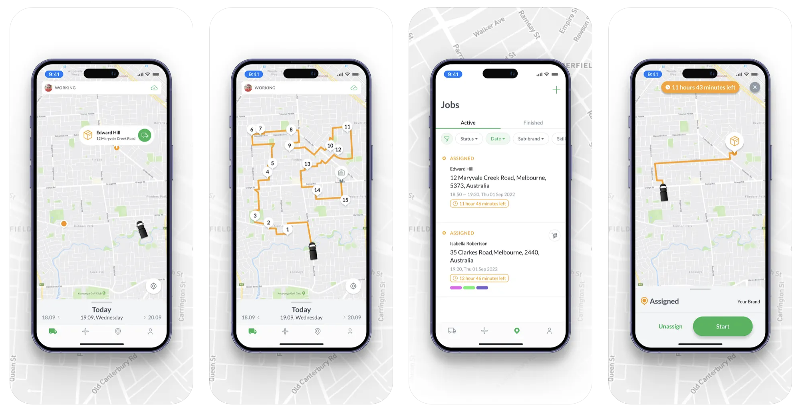
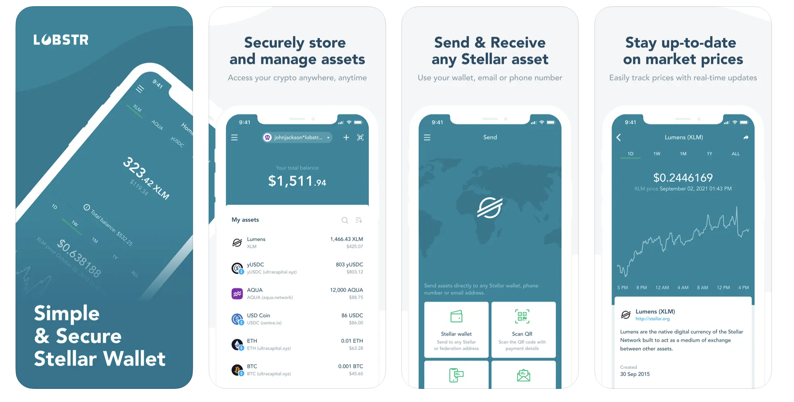

Kanstantsin Klinau Portfolio

Pet Projects

Here are some of my personal projects that showcase my skills and passion for iOS development:

TopPizza: A sample food delivery app built with Swift.

https://github.com/KlinovK/TopPizza

CryptoTracker: A lightweight cryptocurrency price tracker using SwiftUI for real-time market updates.

https://github.com/KlinovK/crypto-tracker

Professional Projects

👋 Hi! I'm a self-taught iOS Engineer. Here's a bit of what I've been working on.

Radaro

Radaro provides your business with driver tracking and customer notifications just like Uber and Domino’s.

Radaro changes the way businesses manage their workforce in real-time on the go, by providing their customers an Uber-like service where customers don’t have to wait unknowingly for a service or a delivery.

Download the Radaro driver app to manage jobs, assist in navigation & communicate with customers.

Our driver app allows you to:

Manage your jobs directly from your iPhone.

Easily navigate to the location of your next job.

Continued use of GPS running in the background can dramatically decrease battery life.

  

Technologies:

- Swift
- RxSwift
- MVVM
- Autolayout
- Promise
- Alamofire
- Bitrise

# [Lobstr](https://apps.apple.com/us/app/lobstr-stellar-lumens-wallet/id1404357892)

LOBSTR - simple & secure Stellar wallet.
LOBSTR is a leading platform for managing Stellar Lumens and other assets issued on the Stellar network.
Discover new tokens, hold, and send any asset, track prices and stay up to date with markets all in one simple and secure app.

  

Technologies:

- Swift
- Objective C
- VIPER
- Autolayout
- NSURLSession
- Bitrise

# [Coindisco](https://apps.apple.com/us/app/coindisco/id6445888906)

Your ultimate guide to navigating the world of cryptocurrencies with ease and confidence. Whether you’re a seasoned enthusiast or just starting your crypto journey, our app brings together the best tools and resources to help you explore, understand, and interact with the crypto ecosystem.

  

Technologies:

- Swift
- MVVM
- CoreData
- Autolayout
- Moya
- Bitrise
